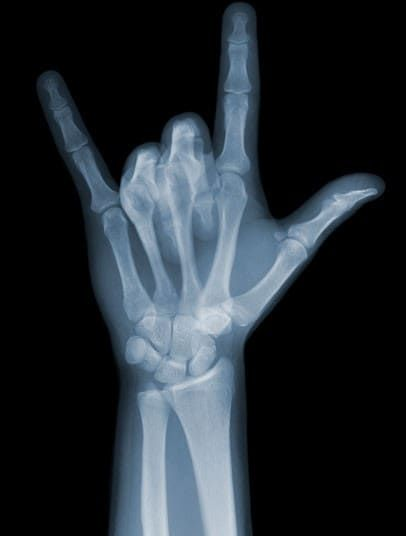

# OAVI_lab8
_Текстурный анализ и контрастирование изображений_

### Вариант: 46

Была поставлена следующая задача:

1. Реализовать расчет матрицы NGTDM (Neighborhood Gray Tone Difference Matrix) с параметром d=2
2. Вычислить текстурные признаки: COS (Coarseness), CON (Contrast), BUS (Busyness)
3. Применить логарифмическое контрастирование к яркостному каналу L в цветовой модели HSL
4. Сравнить признаки для исходного и контрастированного изображений
5. Визуализировать результаты

***

## Функции

Основные функции находятся в файле `texture.py`.

### texture.py

- `RGBtoHSI(image: Image) -> list`
    > Конвертирует изображение из RGB в HSL цветовое пространство
    >
    > _ПАРАМЕТРЫ:_  
    >    * **image** - Изображение в формате PIL.Image  
    >
    > _ВОЗВРАЩАЕТ:_  
    >    * Матрицу значений HSL (list)

- `HSItoRGB(hlsData: list) -> Image`
    > Конвертирует данные HSL обратно в RGB
    >
    > _ПАРАМЕТРЫ:_  
    >    * **hlsData** - Матрица значений HSL  
    >
    > _ВОЗВРАЩАЕТ:_  
    >    * Изображение в формате PIL.Image

- `getLuminanceChannel(hlsData: list) -> np.ndarray`
    > Извлекает канал яркости (L) из HSL данных
    >
    > _ПАРАМЕТРЫ:_  
    >    * **hlsData** - Матрица значений HSL  
    >
    > _ВОЗВРАЩАЕТ:_  
    >    * Массив numpy с каналом яркости

- `LogContrast(lChannel: np.ndarray, factor: float) -> np.ndarray`
    > Применяет логарифмическое контрастирование к каналу яркости
    >
    > _ПАРАМЕТРЫ:_  
    >    * **lChannel** - Канал яркости  
    >    * **factor** - Коэффициент контрастирования  
    >
    > _ВОЗВРАЩАЕТ:_  
    >    * Контрастированный канал яркости

- `NGTDM(lChannel: np.ndarray, d: int) -> np.ndarray`
    > Вычисляет матрицу NGTDM для заданного расстояния d
    >
    > _ПАРАМЕТРЫ:_  
    >    * **lChannel** - Канал яркости  
    >    * **d** - Расстояние для анализа соседей  
    >
    > _ВОЗВРАЩАЕТ:_  
    >    * Матрицу NGTDM

- `textureFeatures(ngtdm: np.ndarray) -> tuple`
    > Вычисляет признаки COS, CON, BUS из матрицы NGTDM
    >
    > _ПАРАМЕТРЫ:_  
    >    * **ngtdm** - Матрица NGTDM  
    >
    > _ВОЗВРАЩАЕТ:_  
    >    * Кортеж с признаками (COS, CON, BUS)

- `histogram(data: np.ndarray, title: str, ax: plt.Axes) -> None`
    > Строит гистограмму яркости
    >
    > _ПАРАМЕТРЫ:_  
    >    * **data** - Данные для гистограммы  
    >    * **title** - Заголовок графика  
    >    * **ax** - Ось для отрисовки  

---

# Работа программы

## Примеры результатов

### Цветок с текстом

#### Оригинальное изображение:

#### Результаты обработки:
<table>
  <tr>
    <td></td>
    <td></td>
  </tr>
  <tr>
    <td></td>
    <td></td>
  </tr>
  <tr>
    <td colspan="2"></td>
  </tr>
</table>

## Текстурные признаки

| Тип изображения   | COS (грубость) | CON (контраст) | BUS (загруженность) |
|-------------------|----------------|----------------|---------------------|
| Исходное          | 0.0511         | 384.4933       | 18.5865             |
| Контрастированное | 0.0565         | 547.4494       | 16.7147             |

### Текстура

#### Оригинальное изображение:

#### Результаты обработки:
<table>
  <tr>
    <td></td>
    <td></td>
  </tr>
  <tr>
    <td></td>
    <td></td>
  </tr>
  <tr>
    <td colspan="2"></td>
  </tr>
</table>

## Текстурные признаки

| Тип изображения   | COS (грубость) | CON (контраст) | BUS (загруженность) |
|-------------------|----------------|----------------|---------------------|
| Исходное          | 0.1381         | 54.3196        | 6.2417              |
| Контрастированное | 0.2224         | 18.9214        | 3.4966              |

### Рентгеновский снимок

#### Оригинальное изображение:

#### Результаты обработки:
<table>
  <tr>
    <td></td>
    <td></td>
  </tr>
  <tr>
    <td></td>
    <td></td>
  </tr>
  <tr>
    <td colspan="2"></td>
  </tr>
</table>

## Текстурные признаки

| Тип изображения   | COS (грубость) | CON (контраст) | BUS (загруженность) |
|-------------------|----------------|----------------|---------------------|
| Исходное          | 0.2401         | 15.0656        | 3.1646              |
| Контрастированное | 0.2235         | 20.2464        | 3.4733              |